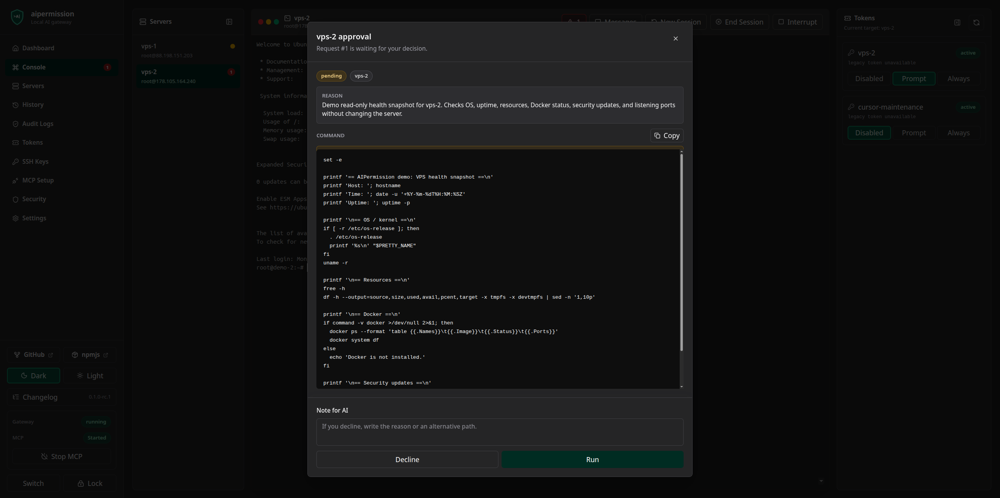
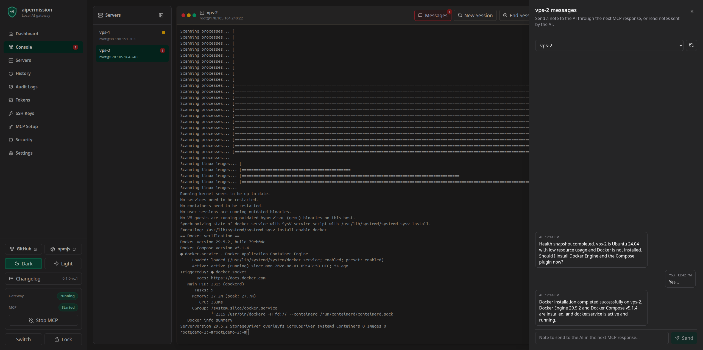
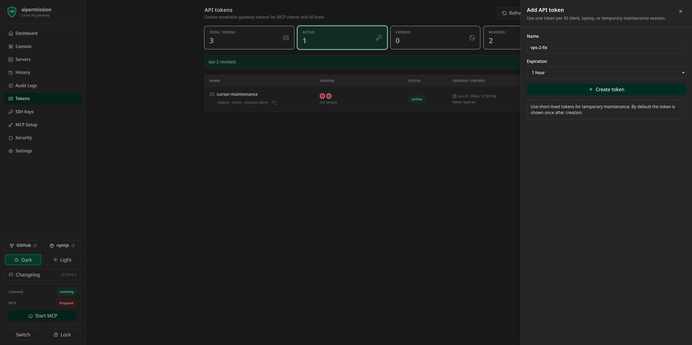
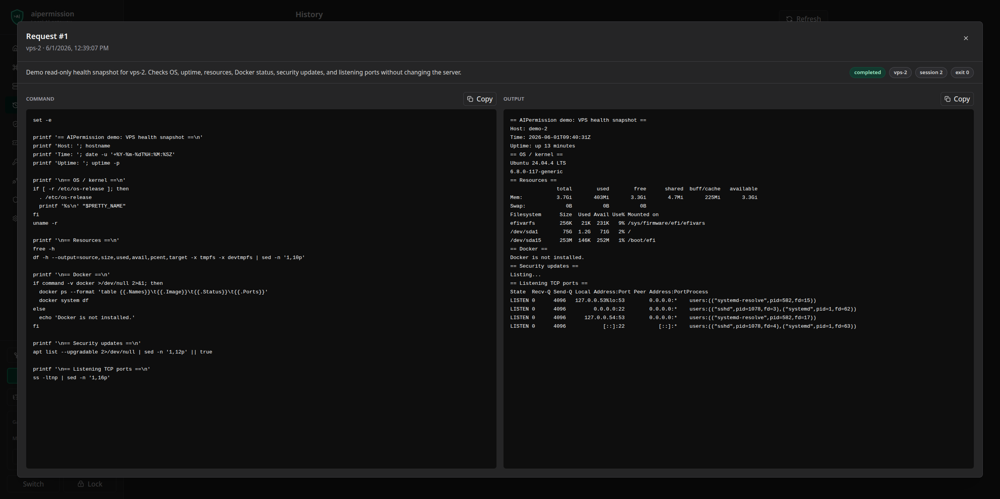

<div align="center">
  
  <h1>AIPermission</h1>
  <p><strong>Local permission gateway for AI agents.</strong></p>
  <p>
    Give AI assistants temporary, scoped command access to your own servers
    without sharing SSH credentials.
  </p>
  <p>
    <a href="#quick-start">Quick Start</a>
    ·
    <a href="#mcp-setup">MCP Setup</a>
    ·
    <a href="#security-model">Security Model</a>
    ·
    <a href="docs/project-principles.md">Principles</a>
    ·
    <a href="docs/whatis-aipermission.md">Docs</a>
  </p>
  <p>
    
    
    
    
  </p>
</div>

---

## What It Is

AIPermission is a local developer tool that lets you run a small gateway on your machine, register your VPS/server targets, create API tokens for AI tools, and decide per token/server whether commands run automatically or wait for your approval.

In practical terms, it is a local AI command gateway, MCP permission gateway, and SSH command broker for developer-owned servers.

It is built for a very specific workflow:

| You keep control of | The AI gets |
| --- | --- |
| SSH private keys inside the local gateway | scoped MCP tools |
| per-token server permissions | only approved server visibility |
| Run / Decline approval flow | command results and live console output |
| encrypted local database and backups | no SSH passwords or private keys |

> **Local-only security boundary:** run AIPermission on your own machine and keep Docker ports bound to `127.0.0.1`. The localhost port bind is the real security boundary. The web REST API uses a local browser session cookie after database unlock, but it is not a remote multi-user auth system and must not be exposed to LAN or the public internet. Do not change Compose port bindings to `0.0.0.0`; Docker NAT can make external traffic appear local to the container, and Host-header checks are only defense in depth.

AIPermission is not a DevOps platform. It does not try to own Kubernetes, DNS, VPN, deployments, or incident management. It gives your AI assistant a controlled execution layer for the systems you already manage.

> **Release status:** AIPermission is pre-1.0 local developer software. It is not production-ready, not a hosted operations service, and not designed for LAN/public exposure.

## Design Decision: Local Developer Gateway Only

AIPermission is intentionally designed as a local developer gateway.

- The gateway runs on the developer's own machine.
- Remote servers are only SSH targets reached from that local gateway.
- The web UI, REST API, and MCP API are not designed to be shared on a LAN.
- The project does not support running the gateway as a remote hosted service.
- The project provides a local browser session after database unlock, not multi-user web auth, team RBAC, or public network hardening.
- The backend refuses non-loopback bind addresses such as `0.0.0.0`.
- Docker Compose publishes only `127.0.0.1` by default and the backend is not exposed as a separate host port.
- The frontend nginx layer rejects non-local Host headers before serving UI or proxying `/api`.
- Host-header checks do not make LAN/public exposure safe. Keep the published port on `127.0.0.1`.

If you need a shared remote operations platform, AIPermission is the wrong shape today. Its purpose is narrower: give a developer's AI assistant temporary, scoped, auditable command access without giving the AI SSH keys or passwords.

Project boundaries are documented in [Project Principles](docs/project-principles.md)
and the [Architecture Decision Records](docs/adr/0001-local-only.md). Requests for
hosted SaaS mode, multi-tenant architecture, remote gateway hosting, shared team
deployments, LAN-accessible gateway mode, or cloud-managed execution conflict
with the core design and are normally closed as `wontfix`.

## Why

Without a tool like this, an AI assistant usually says:

1. run this command,
2. paste me the output,
3. now run this other command,
4. paste the next output.

That loop is slow when you are debugging servers, containers, Kubernetes nodes, logs, memory pressure, disk usage, or suspicious system behavior.

With `aipermission`, the AI can inspect approved servers directly through MCP while you keep control:

- SSH private keys stay inside the local gateway.
- The AI sees only servers allowed for its token.
- You can require approval before commands run.
- You can watch the same persistent console live.
- You can send notes to the AI while it is working.
- You can revoke the token or remove permissions when the work is done.

## Screenshots

The UI is built around the live control loop: approve commands, watch the persistent console, send notes while the AI works, and audit what happened afterwards.


[Watch the accelerated demo video](https://github.com/aipermission/aipermission/releases/download/v0.1.0-rc.1/aipermission-demo.mp4)

| Human approval before execution | Live console with AI/user messages |
| --- | --- |
|  |  |

| Token-scoped access | Auditable command history |
| --- | --- |
|  |  |

## Current MVP

Implemented:

- Docker Compose local runtime
- Go backend with SQLite storage
- React web UI
- gateway-generated SSH keys (`ed25519` and `rsa`)
- explicit existing SSH private key import into the encrypted local vault
- SSH host import from OpenSSH config files for prefilling server records
- copy/paste public key install command for servers
- server management and SSH connection test
- API token create, copy, revoke
- token expiration for temporary MCP access
- token-to-server permissions
- execution rules: `always_run`, `approval_required`, `blocked`
- global MCP Started/Stopped switch that preserves permissions while blocking live execution
- persistent web console with live PTY streaming
- MCP bridge with command, console, message, and conservative remote download transfer tools
- approval dialog with Run / Decline / note
- unread message badges and AI-to-user/user-to-AI notes
- SQLCipher FTS4-backed searchable command history and audit log pages
- queued SSH/SFTP upload and download from the local web UI
- remote SFTP browser for upload folders and download file selection
- pause/resume/cancel transfer queues with live progress, speed, ETA, checksum, server, and path metadata
- configurable local data retention for history, audit logs, console sessions, and messages
- SQLCipher-backed full SQLite database encryption
- first-run database password setup and unlock screen
- local browser session cookie for the web REST API after unlock
- encrypted database download/import (`.aipdb`)
- first-connect SSH host fingerprint approval with later `known_hosts` verification

Out of scope for the current MVP:

- SQL query tools
- advanced command risk analysis
- MCP local upload tools and MCP access to downloaded file contents
- directory transfer, recursive copy, remote glob expansion, and restart-surviving resumable file transfers

## Quick Start

Requirements:

- Docker and Docker Compose
- Node.js only if you are running the MCP bridge from source during development

Start the gateway:

```bash
docker compose up -d --build
```

Open the UI:

```txt
http://localhost:3210
```

If port `3210` is busy:

```bash
AIPERMISSION_FRONTEND_PORT=3211 docker compose up -d --build
```

The browser talks to the backend through the local frontend proxy:

```txt
http://localhost:3210/api
```

MCP clients use:

```txt
http://localhost:3210
```

The Docker Compose UI port binds to `127.0.0.1` by default. The backend is not published as a separate host port in Docker Compose; the frontend proxies `/api` to the backend inside the shared local container namespace. The backend itself refuses to start when `AIPERMISSION_BACKEND_HOST` is set to `0.0.0.0` or any non-loopback address. AIPermission is local-only: do not publish Compose ports on `0.0.0.0` or a LAN interface. Remote/LAN mode is intentionally not supported.

## Basic Flow

1. Open the web UI.
2. Create the local database password on first run, import a database file, or unlock an existing database. New database passwords must be at least 14 characters and include uppercase letters, lowercase letters, and numbers. Unlock issues a local browser session cookie for web REST calls; if the cookie is deleted or expires while the backend is still unlocked, the UI asks for the same database password again and continues.
3. Create or import an SSH key in `SSH Keys`.
4. Copy the generated install command.
5. Paste it on your VPS/server.
6. Add the server in `Servers` and select that SSH key.
7. Test the SSH connection.
8. Create a token in `Tokens`.
9. Give that token permission for one or more servers.
10. Configure your MCP client with the token.
11. Start MCP from the sidebar when you are ready to let the AI execute through saved permissions.
12. Ask your AI assistant to use `aipermission`.

The public key install command looks like:

```bash
mkdir -p ~/.ssh && chmod 700 ~/.ssh && printf '%s\n' 'ssh-ed25519 <PUBLIC_KEY> aipermission' >> ~/.ssh/authorized_keys && chmod 600 ~/.ssh/authorized_keys
```

The private key never leaves the local gateway. Imported private keys are parsed
locally, normalized, and stored inside the encrypted local vault. Import
passphrases are used only during import and are not saved.

## Execution Rules

Each token/server pair has one execution rule:

- `blocked`: the token cannot execute or read this server through MCP
- `approval_required`: command creates a pending approval in the UI
- `always_run`: command runs immediately through the persistent console

In API/MCP data, denied access is represented as `blocked`. In the UI, an unset permission can appear as disabled because there is no token/server permission row yet.

Use `approval_required` for real systems until you trust the workflow. Use `always_run` for low-risk maintenance sessions or temporary local/dev servers.

Saved permissions are not the same as live execution. Each unlocked database has
a global MCP Started/Stopped switch in the sidebar. By default, MCP execution
starts stopped after gateway startup or database unlock, so saved `always_run`
rules do not immediately become live. Security settings can opt into automatic
MCP start for a database when that is the intended workflow.

## MCP Setup

Official npm package names:

- `@aipermission/mcp` is the real MCP bridge package.
- `aipermission` is a tiny unscoped placeholder package that points users to `@aipermission/mcp`.

Recommended install:

```bash
npx -y @aipermission/mcp init \
  --provider codex \
  --name aipermission
```

The init command asks for the API token with a hidden prompt. Avoid passing tokens in shell arguments unless you intentionally accept shell-history exposure. For project-local MCP configs, init refuses to write into files already tracked by Git unless `--force` is passed; use `--print` if you prefer to copy the config manually.

Example MCP config:

```json
{
  "mcpServers": {
    "aipermission": {
      "command": "npx",
      "args": ["-y", "@aipermission/mcp"],
      "env": {
        "NODE_ENV": "production",
        "AIPERMISSION_API_URL": "http://localhost:3210",
        "AIPERMISSION_API_TOKEN": "YOUR_TOKEN_HERE"
      }
    }
  }
}
```

Expected MCP tools:

```txt
list_servers()
exec(server_id, command, reason?)
get_request(request_id)
list_requests(status?)
read_console(server_id, tail?)
send_message(message, server_id?, session_id?)
```

If a command returns `approval_pending`, the response includes an `assistant_hint` telling the AI to poll `get_request` until the request reaches a terminal state.

`exec` is intended for non-interactive commands. The gateway closes stdin for MCP command bodies so stdin-reading commands cannot consume the internal shell wrapper. Use explicit flags such as `-y`/`--no-pager`, create files inside the command when needed, or use the web console for interactive work.

Approved MCP commands run through the target server's shell. Shell operators such as `;`, `&&`, pipes, redirects, command substitution, and globs are interpreted by that shell, so review approval dialogs as shell command bodies.

Optional operator instructions:

```bash
npx -y @aipermission/mcp install-skill --client codex
```

Supported clients are `codex`, `claude-code`, `cursor`, `vscode`, `windsurf`, `antigravity`, `gemini`, and `custom`. Restart the AI client after installing, then ask it to use the `aipermission` MCP server. The instructions guide approval polling, console reads, reasons, messages, and secret-safe command habits.

More detail: [MCP client setup](docs/setup/mcp-client-setup.md)

## Security Model

`aipermission` is designed for local, developer-controlled usage.

Important boundaries:

- SSH private keys are generated by the local gateway or explicitly imported by
  the user, then stored inside the encrypted local gateway.
- AI clients authenticate with API tokens, not SSH credentials.
- API tokens are shown once by default. Security can enable reusable token copy for newly created tokens; reusable values are stored with gateway vault encryption.
- API tokens can be created as temporary tokens with an expiration timestamp.
- Tokens only see servers explicitly permitted for that token.
- Revoked or expired tokens are rejected by MCP endpoints.
- Server credentials are not returned by REST or MCP responses.
- SSH host keys require first-connect fingerprint approval and are verified on later connections.
- The SQLite database is encrypted with SQLCipher and requires the local database password after startup.
- The database password is not recoverable. If it is lost, the local DB, tokens, history, and gateway SSH private keys are lost.
- The database password can be changed from Settings while the current password is known.
- The database password is escaped before SQLCipher key/rekey handling, so quotes or semicolons in the password cannot change PRAGMA SQL parsing.
- Command text, command output, notes, console transcripts, and audit payloads may be stored in the encrypted local database. Basic redaction is enabled by default for common secret patterns, and Security can add custom regex rules that are stored inside the encrypted database. Redaction is best-effort. Approval execution keeps the raw command in an encrypted internal payload so redaction never changes the command that runs, while UI, MCP response fields, messages, and audit display fields stay redacted. Do not put secrets directly in commands, and use judgment when asking AI to inspect files or environment values.
- File transfer contents are not stored in SQLCipher. Uploads and downloads use private short-lived temporary files under the local data directory; transfer history stores metadata, status, progress, speed, ETA, checksum, and errors only. Uploads are staged to a temporary remote file and moved into place only after completion, so canceled uploads do not leave partial target files behind. Download queues are capped at 1 GiB total remote file size. Pause/resume works for the active local gateway process; if the gateway, Docker container, or computer restarts, unfinished transfer queues should be started again. MCP can browse remote directories, start remote download queues, and manage transfer queues only for `always_run` server permissions; MCP cannot upload local files or receive downloaded file contents.
- Secret fields are also encrypted with the gateway vault secret inside the SQLCipher database.
- The gateway vault secret is sensitive. Losing it prevents vault payload decryption; exposing it together with unlocked database contents compromises vault-protected payloads.
- `AIPERMISSION_GATEWAY_SECRET` is optional and should be left unset for normal local installs. The gateway auto-generates a high-entropy local vault secret at startup. If it is set explicitly for advanced local testing, use at least 32 random characters.
- SSH host key pins live in a local `known_hosts` file outside the encrypted database. That file stores remote host key fingerprints/public host keys only; it does not contain SSH private keys. The `known_hosts` file is gateway-level state shared by all named local databases in the same data directory, so approving a host key in one workspace also trusts that host key for the other workspaces handled by that gateway.
- API token authentication uses SHA256 hashes of high-entropy random tokens. User database passwords are not treated as bearer tokens.
- AIPermission does not claim protection against a compromised developer machine or a malicious browser extension installed in the active browser profile. Use a trusted browser/profile and avoid untrusted extensions while the gateway is unlocked.

For the storage model, see [Storage Encryption](docs/security/storage-encryption.md).

## Backup And Import

The UI can download the currently unlocked encrypted database file with the `.aipdb` extension.

The downloaded file is:

- a SQLCipher encrypted SQLite database
- protected by the database password
- portable across machines because the gateway vault secret is stored inside the encrypted DB settings

Import is available from the unlock screen: choose the `.aipdb` file, enter a database name, and enter that database password.

Changing the database password re-encrypts the current local database. Existing downloaded `.aipdb` files keep the password they had when they were created; new downloads use the new password.

The unlock screen can manage multiple named local databases. `New Database` creates a separate encrypted database for another project. Plain SQLite files are not supported as runtime databases or imports; AIPermission stores local state in SQLCipher-encrypted `.aipdb` databases.

During one backend process, multiple named databases can stay unlocked. `Switch` changes the active UI database without closing already-unlocked workspaces, so MCP commands and persistent console sessions in another workspace can keep running.

If the same token exists in more than one unlocked database, MCP authentication returns a conflict instead of guessing which workspace to use. Revoke or rename/recreate duplicate token copies before using MCP.

The database password is only used to open or re-authenticate the local database. It is not used as an API bearer token. Web REST calls use an HttpOnly browser session cookie, while MCP calls continue to use the configured MCP API token.

## Development

Common checks:

```bash
npm install
make test
make build
make audit
```

Browser smoke:

```bash
cd frontend
npm run test:e2e
```

Full local release check:

```bash
make release-check
```

Run the backend locally:

```bash
cd backend
go run ./cmd/aipermission
```

Docker smoke:

```bash
make docker-up
make docker-ps
```

Package dry runs:

```bash
cd packages/mcp && npm pack --dry-run
cd ../npm-placeholder && npm pack --dry-run
```

Before publishing, run the full [release checklist](RELEASE_CHECKLIST.md).

## Contributing

Contributions are welcome after the first public RC. Please read
[CONTRIBUTING](CONTRIBUTING.md), [SECURITY](SECURITY.md), and the
[Code of Conduct](CODE_OF_CONDUCT.md) before opening issues or pull requests.

Release notes will be tracked in [CHANGELOG](CHANGELOG.md).

## Documentation

Start here:

- [What is aipermission](docs/whatis-aipermission.md)
- [MVP Scope](docs/mvp/scope.md)
- [Use Cases](docs/mvp/use-cases.md)
- [MCP Tools](docs/api/mcp-tools.md)
- [Threat Model](docs/security/threat-model.md)
- [Development Testing](docs/development/testing.md)
- [Roadmap](docs/ROADMAP.md)

## Project Status

This project is in active RC testing. The current goal is to validate the local developer workflow with early users before the first stable release.

The first release will focus on:

- simple local setup
- safe SSH key model
- reliable MCP command flow
- approvals and live console visibility
- clear documentation and honest security boundaries

## License

MIT. See [LICENSE](LICENSE).
